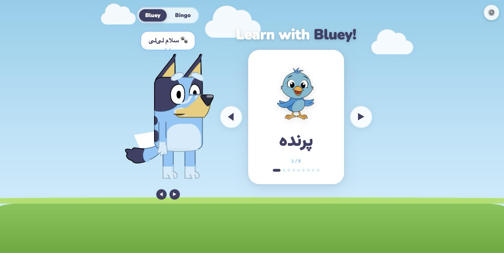

# Learn with Bluey

A Persian-language flashcard web app. Each card shows a picture and a Farsi word, and
an animated CSS-drawn Bluey speaks the word aloud using the ElevenLabs text-to-speech
API. Built to teach my daughter her first Farsi vocabulary.



## What it does

- **Two decks** — nine animals and eleven face/body parts, navigable by arrows, arrow
  keys, or swipe on touch devices.
- **Two characters** — Bluey and Bingo, each assigned its own ElevenLabs voice. Switching
  character also switches deck.
- **Spoken words on demand** — tapping a card synthesises and plays the Farsi word.
  Tapping the character plays a greeting.
- **Lip sync** — the character's mouth animates for the duration of the returned audio,
  cycling through four viseme shapes.

## Dependencies

### Runtime

There are **no build tools, package manager, or backend** — the app is static HTML, CSS
and ES modules. Nothing to install.

| Dependency | Purpose | Notes |
|---|---|---|
| [ElevenLabs API](https://elevenlabs.io/docs) | Text-to-speech | Requires your own API key. Free tier is sufficient. |
| Google Fonts (Nunito, Vazirmatn) | Latin + Persian typefaces | Loaded via CDN in `index.html`. Vazirmatn renders the Farsi text. |
| A modern browser | — | Needs ES modules, IndexedDB, `fetch`, and the Web Audio/`<audio>` element. |

### Development

A static file server is the only requirement. Python's built-in one is enough:

```bash
python3 -m http.server 8000
```

The app **must** be served over HTTP. Opening `index.html` as a `file://` URL fails,
because ES modules and `fetch('greetings.json')` are blocked by CORS on that scheme.

## ElevenLabs integration

All API code lives in `tts.js`.

| Detail | Value |
|---|---|
| Synthesis endpoint | `POST /v1/text-to-speech/{voice_id}` |
| Voice listing endpoint | `GET /v2/voices` |
| Model | `eleven_v3` |
| Output format | `mp3_44100_128` |
| Voice settings | `stability: 0.5`, `similarity_boost: 0.75`, `speed: 0.9` |

**The model is fixed at `eleven_v3` and is not configurable.** Persian (`fas`) is only
listed as a supported language for v3 — it is absent from `eleven_multilingual_v2` and
the flash/turbo models. Speed is reduced to `0.9` because default pacing is too fast for
a small child to imitate.

### Caching

Every synthesised clip is stored in IndexedDB (database `bluey-tts`, store `clips`) under
the key `model|voice|text`. A word is therefore requested from the API once per browser;
every later playback is served from the cache, costing nothing and starting instantly.
When a card is displayed, the next and previous words are prefetched in the background.

Without this, a child tapping the same picture repeatedly would re-request identical
audio every time. Cached clips can be dropped from the settings panel.

### Cost

The complete vocabulary is roughly 136 characters of Persian text. At 1 credit per
character that is ~136 credits to generate everything once, against the free tier's
10,000 credits per month.

## API key handling

The key is entered through the ⚙️ settings panel and stored in `localStorage` under
`bluey.elevenlabs.apiKey`. It is sent only to `api.elevenlabs.io`.

**There is no API key in this repository and no config file to put one in.** This is
deliberate — the repo is public. `.gitignore` additionally blocks `.env`, `*.key` and
similar files so a local credential cannot be committed by accident.

## Setup

```bash
git clone https://github.com/sogandgh/bluey.git
cd bluey
python3 -m http.server 8000
```

1. Open `http://localhost:8000`.
2. The settings panel opens automatically on first run.
3. Paste an [ElevenLabs API key](https://elevenlabs.io/app/settings/api-keys) and click
   **Save key & load voices**.
4. Choose a voice for Bluey and one for Bingo. Two are pre-selected automatically.

## Adding vocabulary

Add an entry to the relevant array in `app.js`:

```js
{ img: 'pictures/animals/duck.png', word: 'اردک' }
```

Drop the image in `pictures/`. No audio file, recording, or manifest update is needed —
the word is synthesised on first use. Greetings live in `greetings.json` and are
text-only in the same way.

## Project structure

```
index.html      markup, settings panel, font + script loading
app.js          state, navigation, lip sync, settings wiring
tts.js          ElevenLabs client, IndexedDB cache, voice listing
bluey.css       the Bluey/Bingo character, drawn entirely in CSS
style.css       layout, background scene, settings panel, toast
greetings.json  greeting phrases per character
pictures/       flashcard images
```

`bluey.css` builds both characters out of positioned and rounded `div`s — there are no
character images. Bingo is the same markup re-skinned through a `.bingo-mode` class.

## Browser support

Requires ES modules, IndexedDB and `fetch`. Tested in Chrome and Safari. Because browsers
block autoplay before a user gesture, the greeting on page load may stay silent until the
first tap.

## Licence and attribution

Bluey is a creation of [Ludo Studio](https://www.ludostudio.com.au/). This is an
unaffiliated personal project, not endorsed by or connected to the rights holders, and is
not intended for commercial use.
