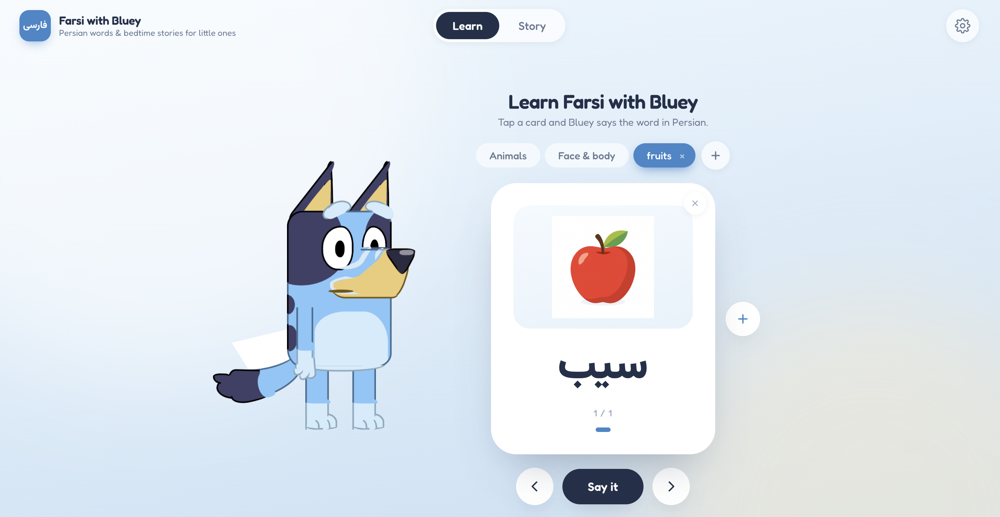
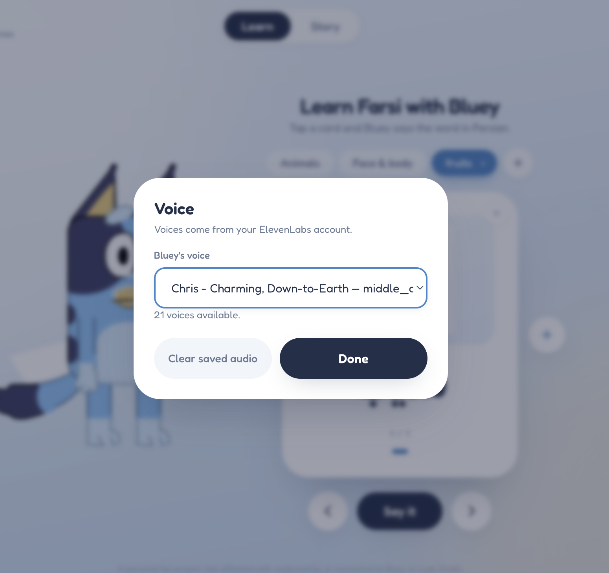
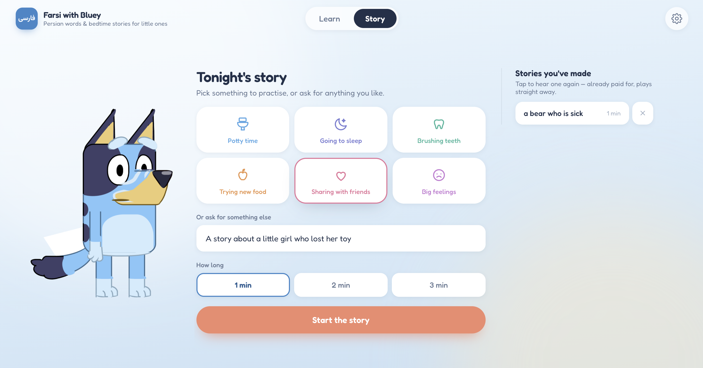
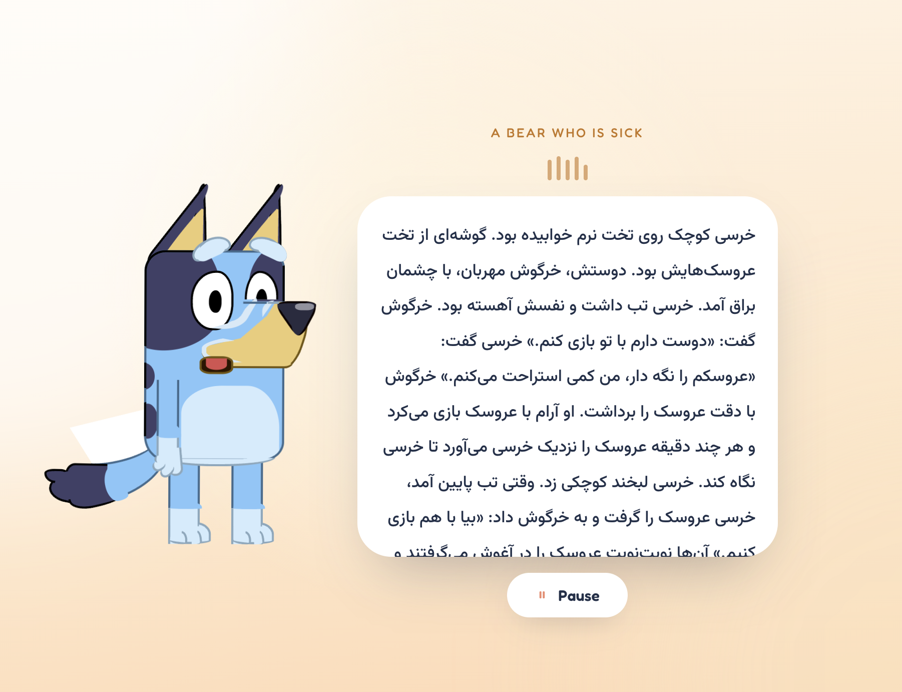

# Dastaan

A language learning app for kids built around an animated character that does three things:

**AI-Generated Flashcards.** Create a collection, Colors, Family, whatever your kid is into this week, and add words to it by typing them, in English or Persian. Translated, illustrated, and voiced, all in one step. Tap a card, the character says the word in Farsi.

**Tell a bedtime story your way.** Pick a focus like potty training, bedtime, brushing teeth, trying new food, sharing, big feelings and/or type your own idea. The character narrates a short Farsi story built around it, with a generated image for each part of the story, while your kid just watches and listens, no reading required.

## Screenshots

## Requirements

| Needed | Version | Why |
| --- | --- | --- |
| [Node.js](https://nodejs.org) | 18+ | Runs `server.js` |
| [ElevenLabs API](https://elevenlabs.io/docs) key | n/a | Text-to-speech model. Needs `text_to_speech` and `voices_read` permissions. Model is `eleven_v3`.  |
| [OpenAI API](https://platform.openai.com/api-keys) key | n/a |  writes the Farsi stories, and generates the illustration for each custom flashcard. |
| [Supabase](https://supabase.com) project | n/a | Real accounts (sign in/sign up) and where each family's vocabulary/stories live. Free tier is enough. |

## How to run

1. Create a free project at [supabase.com](https://supabase.com), then in its SQL Editor run `supabase/schema.sql` from this repo (creates the `collections`/`cards`/`stories` tables and their Row Level Security policies).
2. From Project Settings → API, grab the **Project URL** and the **anon public** key (not `service_role`; that one's only for the migration script below, never for the running app).
3. Paste them into `auth.js` in place of `SUPABASE_URL_PLACEHOLDER`/`SUPABASE_ANON_KEY_PLACEHOLDER`. They're public by design (Row Level Security is what actually protects the data), so this file is safe to commit as-is.

```bash
git clone https://github.com/sogandgh/dastaan.git
cd dastaan
npm install
export ELEVENLABS_API_KEY=sk_your_key_here
export OPENAI_API_KEY=sk-your_key_here
export SUPABASE_URL=https://your-project.supabase.co
export SUPABASE_ANON_KEY=your_anon_key_here
node server.js
```

Open **http://localhost:8000**. It lands on the sign-in page first; create an account to get in. Voices load automatically from your ElevenLabs account; change which one it uses from the ⚙️ panel.

`PORT` overrides the port (default `8000`); `OPENAI_MODEL` overrides the story model (default `gpt-5-mini`); `OPENAI_IMAGE_MODEL` overrides the illustration model (default `gpt-image-1-mini`).

Had vocabulary or stories from before accounts existed? Run `scripts/migrate-to-supabase.mjs` once. See the comment at the top of that file for the exact steps.

To reach it from a phone on the same wifi, use your computer's LAN IP instead of `localhost`, e.g. `http://10.0.0.108:8000`.

## Notes

The narrator, Lily (لی‌لی), is an original character made for this project, not affiliated with any existing show or studio. A personal project, not for commercial use.
